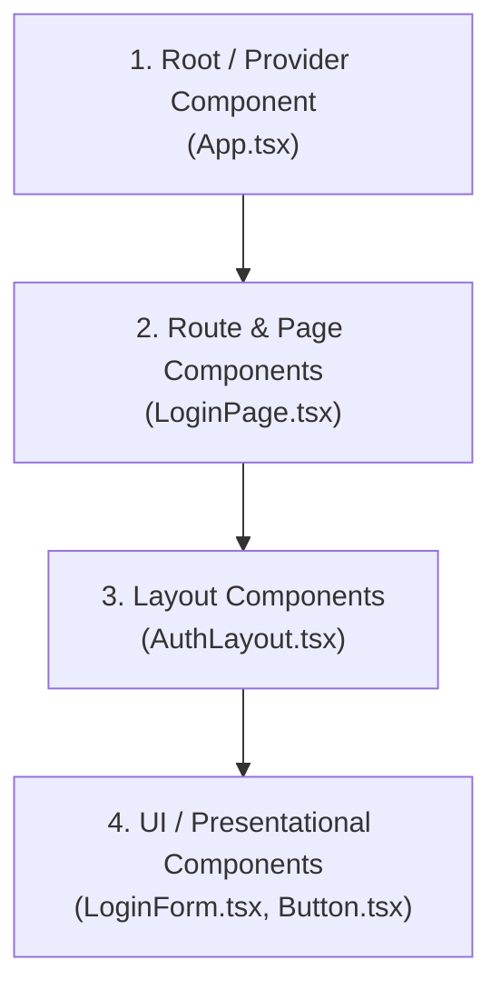

# 📚 Ôn tập React - Phần 1: JSX, Component Architecture & Layout Composition

Chào mừng bạn đến với Phần 1 trong lộ trình ôn tập React! 

Tài liệu này được thiết kế dựa trên chính mã nguồn của dự án **Bookstore E-commerce** (`frontend/src`), giúp bạn vừa nắm vững lý thuyết cốt lõi, vừa hiểu rõ cách áp dụng trong dự án thực tế.

---

## 📋 Mục lục nội dung
1. [Bản chất & Quy tắc của JSX trong React 19](#1-bản-chất--quy-tắc-của-jsx-trong-react-19)
2. [Kiến trúc Component (Component Architecture)](#2-kiến-trúc-component-component-architecture)
3. [Kĩ thuật Layout Composition & Prop `children`](#3-kĩ-thuật-layout-composition--prop-children)
4. [Phân tích chi tiết Mã nguồn Dự án](#4-phân-tích-chi-tiết-mã-nguồn-dự-án)
5. [Bài tập Thực hành & Tự kiểm tra](#5-bài-tập-thực-hành--tự-kiểm-tra)

---

## 1. Bản chất & Quy tắc của JSX trong React 19

### 1.1 JSX là gì?
**JSX (JavaScript XML)** là một cú pháp mở rộng cho JavaScript, cho phép bạn viết HTML trực tiếp bên trong mã JavaScript.

Bản chất của JSX **không phải là HTML**. Khi chạy qua công cụ biên dịch (Vite / Babel / SWC), cú pháp JSX như:
```tsx
<h1 className="text-xl">BookStore</h1>
```
sẽ được chuyển đổi thành hàm JavaScript thuần:
```js
// Trước React 17: React.createElement('h1', { className: 'text-xl' }, 'BookStore')
// Từ React 17/19 (JSX Transform): _jsx("h1", { className: "text-xl", children: "BookStore" })
```

### 1.2 4 Quy tắc cốt lõi khi viết JSX
1. **Trả về duy nhất 1 Root Element**:
   * Mỗi component phải trả về một thẻ bao ngoài duy nhất. Nếu không muốn tạo thêm thẻ `<div>` thừa trên DOM, sử dụng **React Fragment** (`<>...</>`).
   ```tsx
   // ❌ Lỗi biên dịch:
   return (
     <h1>Title</h1>
     <p>Description</p>
   );

   // ✅ Đúng (Dùng Fragment):
   return (
     <>
       <h1>Title</h1>
       <p>Description</p>
     </>
   );
   ```

2. **Đóng tất cả các thẻ (Self-closing tags)**:
   * Tất cả các thẻ HTML đơn như ``, `<input>`, `<br>` phải có dấu xuyệt đóng thẻ `/>`.
   ```tsx
   
   <input type="email" {...register('email')} />
   ```

3. **Cú pháp CamelCase cho thuộc tính (Attributes)**:
   * Vì JSX biên dịch thành JavaScript Object, các từ khóa HTML được đổi thành camelCase:
     * `class` ➔ `className`
     * `for` ➔ `htmlFor`
     * `tabindex` ➔ `tabIndex`
     * `onclick` ➔ `onClick`
     * `style` ➔ Nhận một Object: `style={{ backgroundColor: '#f5f8f8' }}`

4. **Nhúng biểu thức JS bằng dấu ngoặc nhọn `{}`**:
   * Bạn có thể đưa bất kỳ giá trị, biến, hàm hay toán tử 3 ngôi (ternary operator) nào vào trong `{}`.
   ```tsx
   <h1>{title}</h1>
   <p>{isLogin ? "Chào mừng trở lại!" : "Đăng ký tài khoản"}</p>
   ```

---

## 2. Kiến trúc Component (Component Architecture)

Trong các ứng dụng React hiện đại, dự án được chia thành các tầng Component theo trách nhiệm (Single Responsibility Principle):



### 4 Tầng Component trong Dự án:
1. **Root / Provider Layer** ([App.tsx](file:///d:/Data/Project/se400-bookstore-e-ecommerce/bookstore-e-commerce/frontend/src/App.tsx)): Thiết lập Context Provider cho toàn bộ ứng dụng (`QueryClientProvider`, `BrowserRouter`).
2. **Page Layer** ([LoginPage.tsx](file:///d:/Data/Project/se400-bookstore-e-ecommerce/bookstore-e-commerce/frontend/src/pages/LoginPage.tsx)): Đại diện cho 1 trang tại đường dẫn URL (như `/login`). Chỉ đóng vai trò ghép nối Layout và UI.
3. **Layout Layer** ([AuthLayout.tsx](file:///d:/Data/Project/se400-bookstore-e-ecommerce/bookstore-e-commerce/frontend/src/layouts/AuthLayout.tsx)): Quản lý khung xương giao diện dùng chung (Header, Navigation tabs, Background).
4. **UI / Form Layer** ([LoginForm.tsx](file:///d:/Data/Project/se400-bookstore-e-ecommerce/bookstore-e-commerce/frontend/src/components/auth/LoginForm.tsx)): Chứa giao diện tương tác chi tiết và logic xử lý Form.

---

## 3. Kĩ thuật Layout Composition & Prop `children`

### 3.1 Vấn đề của cách làm cũ (Không dùng Composition)
Nếu mỗi trang (`LoginPage`, `RegisterPage`, `ResetPasswordPage`) tự viết lại phần Header, Background, Logo và Khung thẻ Auth, mã nguồn sẽ bị **trùng lặp rất nhiều (DRY violation)**.

### 3.2 Giải pháp với Prop `children`
React cung cấp prop đặc biệt tên là `children`. Bất kỳ mã JSX nào nằm ở giữa thẻ đóng và thẻ mở của Component cha sẽ tự động được truyền vào `children`.

```tsx
// 1. Component Layout định nghĩa vị trí hiển thị qua {children}
export function AuthLayout({ children, title }: AuthLayoutProps) {
  return (
    <div className="layout-background">
      <Header />
      <h1>{title}</h1>
      <main>
        {children} {/* Nội dung linh hoạt của từng trang sẽ chui vào đây */}
      </main>
    </div>
  );
}

// 2. Component Trang truyền UI mong muốn vào trong <AuthLayout>
export default function LoginPage() {
  return (
    <AuthLayout title="Welcome Back">
      <LoginForm /> {/* <LoginForm /> chính là `children` của AuthLayout */}
    </AuthLayout>
  );
}
```

---

## 4. Phân tích chi tiết Mã nguồn Dự án

Hãy cùng xem cách 3 file minh họa trong dự án thực tế hoạt động cùng nhau:

### 4.1 Component Gốc: [App.tsx](file:///d:/Data/Project/se400-bookstore-e-ecommerce/bookstore-e-commerce/frontend/src/App.tsx)
```tsx
import { BrowserRouter, Route, Routes } from 'react-router-dom';
import { QueryClient, QueryClientProvider } from '@tanstack/react-query';
import { routes } from '@/routes';

function App() {
  // Tạo client instance cho React Query (Data Fetching Cache)
  const queryClient = new QueryClient({
    defaultOptions: {
      queries: { refetchOnWindowFocus: false },
    },
  });

  return (
    // Provider Pattern: Bao bọc ứng dụng để truyền QueryClient & Routing context
    <QueryClientProvider client={queryClient}>
      <BrowserRouter>
        <Routes>
          {routes.map((route) => (
            <Route key={route.path} {...route} />
          ))}
        </Routes>
      </BrowserRouter>
    </QueryClientProvider>
  );
}

export default App;
```
> 💡 **Điểm cần nhớ**: `App.tsx` sử dụng **Composition Pattern của Provider**. `BrowserRouter` nằm bên trong `QueryClientProvider`, nhờ đó tất cả trang và component bên trong đều sử dụng được cả 2 dịch vụ này.

---

### 4.2 Component Trang & Layout: [LoginPage.tsx](file:///d:/Data/Project/se400-bookstore-e-ecommerce/bookstore-e-commerce/frontend/src/pages/LoginPage.tsx) & [AuthLayout.tsx](file:///d:/Data/Project/se400-bookstore-e-ecommerce/bookstore-e-commerce/frontend/src/layouts/AuthLayout.tsx)

* **Trang Login** ([LoginPage.tsx](file:///d:/Data/Project/se400-bookstore-e-ecommerce/bookstore-e-commerce/frontend/src/pages/LoginPage.tsx)):
```tsx
import { LoginForm } from '@/components/auth/LoginForm';
import { AuthLayout } from '@/layouts/AuthLayout';

export default function LoginPage() {
    return (
        <AuthLayout
            title="Welcome Back"
            subtitle="Login to continue your literary journey."
        >
            <LoginForm />
        </AuthLayout>
    );
}
```

* **Layout Auth** ([AuthLayout.tsx](file:///d:/Data/Project/se400-bookstore-e-ecommerce/bookstore-e-commerce/frontend/src/layouts/AuthLayout.tsx#L6-L68)):
```tsx
interface AuthLayoutProps {
    children: React.ReactNode; // Định nghĩa kiểu TypeScript cho children
    title: string;
    subtitle: string;
    showTabs?: boolean;
}

export function AuthLayout({ children, title, subtitle, showTabs = true }: AuthLayoutProps) {
    return (
        <div className="min-h-screen flex flex-col bg-[#f5f8f8]">
            <header>...</header>
            
            <main className="flex-1 flex items-center justify-center">
                <div className="w-full max-w-md">
                    <h1>{title}</h1>
                    <p>{subtitle}</p>

                    {/* Vị trí render LoginForm */}
                    {children} 
                </div>
            </main>
        </div>
    );
}
```

---

### 4.3 Component Form UI: [LoginForm.tsx](file:///d:/Data/Project/se400-bookstore-e-ecommerce/bookstore-e-commerce/frontend/src/components/auth/LoginForm.tsx#L13-L87)
```tsx
export function LoginForm() {
    const [showPassword, setShowPassword] = useState(false);

    return (
        <form onSubmit={handleSubmit(onSubmit)} className="space-y-5">
            {/* Input Email */}
            <div className="space-y-2">
                <Label htmlFor="email">Email Address</Label>
                <Input id="email" type="email" {...register('email')} />
            </div>

            {/* Input Password với nút ẩn/hiện */}
            <div className="space-y-2">
                <div className="relative">
                    <Input id="password" type={showPassword ? 'text' : 'password'} />
                    <button type="button" onClick={() => setShowPassword(!showPassword)}>
                        {showPassword ? <EyeOff /> : <Eye />}
                    </button>
                </div>
            </div>

            <Button type="submit">Login</Button>
        </form>
    );
}
```
> 💡 **Điểm cần nhớ**: `LoginForm` tập trung 100% vào UI Form, không hề chứa mã HTML của khung trang hay Header. Nó tuân thủ nguyên tắc **Single Responsibility Principle**.

---

## 5. Bài tập Thực hành & Tự kiểm tra

### 🎯 Câu hỏi kiểm tra lý thuyết:
1. Tại sao đoạn mã JSX sau bị lỗi biên dịch và làm sao để sửa?
   ```tsx
   return (
     <h1>BookStore</h1>
     <p>Welcome to our store</p>
   );
   ```
2. Prop `children` trong TypeScript có kiểu dữ liệu là gì?
3. Sự khác biệt giữa **Page Component** (như `LoginPage.tsx`) và **UI Component** (như `LoginForm.tsx`) là gì?

---

### 🛠️ Bài tập thực hành:
Tạo một Component Layout tên là `CardLayout.tsx` nhận vào `title: string` và `children: React.ReactNode`. Sử dụng nó để bao bọc một đoạn mã bất kỳ.

**Gợi ý đáp án bài tập thực hành**:
```tsx
import React from 'react';

interface CardLayoutProps {
  title: string;
  children: React.ReactNode;
}

export function CardLayout({ title, children }: CardLayoutProps) {
  return (
    <div className="p-6 bg-white rounded-xl shadow-md border border-stone-200">
      <h2 className="text-xl font-bold mb-4 text-stone-800">{title}</h2>
      <div className="card-content">
        {children}
      </div>
    </div>
  );
}
```

---
*Chúc mừng bạn đã hoàn thành Phần 1! Hãy sẵn sàng để tiếp tục với **Phần 2: Core Hooks (`useState`, `useEffect` & Custom Hooks)**.*
