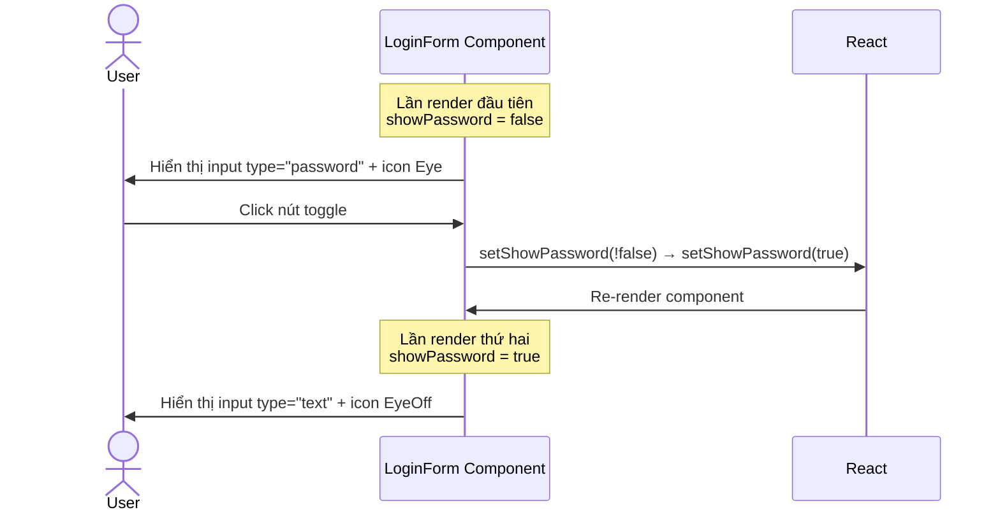
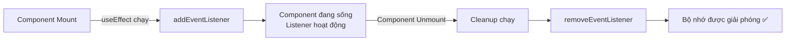
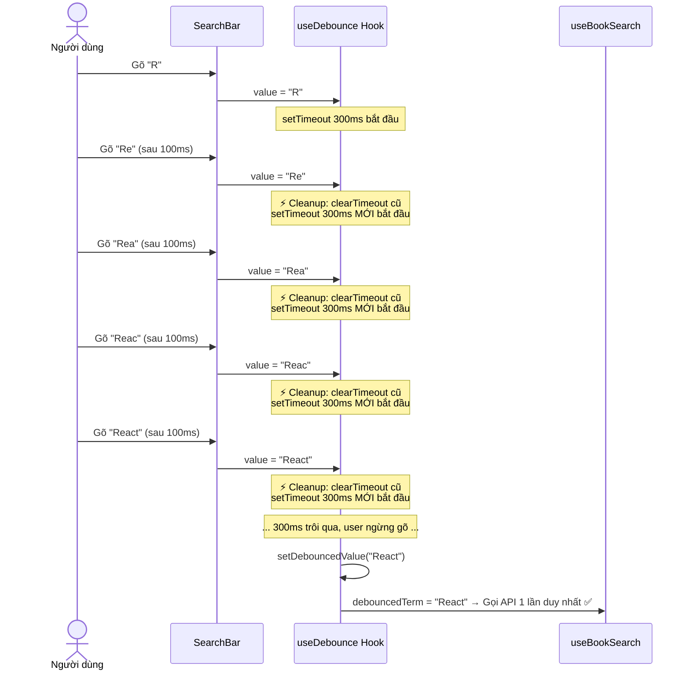
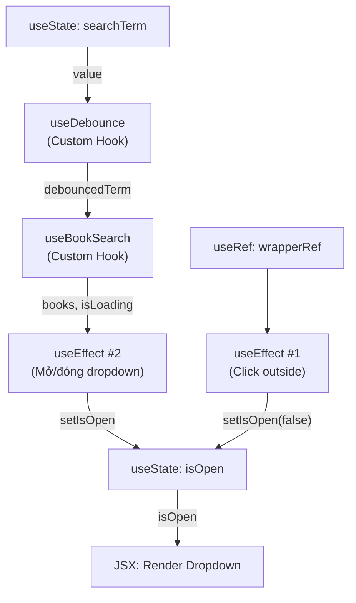

# 📚 Ôn tập React - Phần 2: Core Hooks (`useState`, `useEffect`, `useRef` & Custom Hooks)

> **Tiền đề**: Bạn đã nắm được JSX và Component Architecture ở [Phần 1](file:///d:/Data/Project/se400-bookstore-e-ecommerce/bookstore-e-commerce/docs/react-guide/01_jsx_component_architecture.md). Phần này sẽ đi sâu vào **trái tim** của React: **Hooks** — cơ chế cho phép Functional Component có trạng thái và xử lý side-effect.

---

## 📋 Mục lục
1. [Hooks là gì? Tại sao phải dùng Hooks?](#1-hooks-là-gì-tại-sao-phải-dùng-hooks)
2. [`useState` — Quản lý trạng thái nội bộ](#2-usestate--quản-lý-trạng-thái-nội-bộ)
3. [`useEffect` — Xử lý Side-Effect](#3-useeffect--xử-lý-side-effect)
4. [`useRef` — Tham chiếu DOM & Giá trị bền vững](#4-useref--tham-chiếu-dom--giá-trị-bền-vững)
5. [Custom Hooks — Tách logic tái sử dụng](#5-custom-hooks--tách-logic-tái-sử-dụng)
6. [Tổng hợp: Phân tích `SearchBar.tsx` — Component sử dụng tất cả Hooks](#6-tổng-hợp-phân-tích-searchbartsx--component-sử-dụng-tất-cả-hooks)
7. [Bài tập Thực hành & Tự kiểm tra](#7-bài-tập-thực-hành--tự-kiểm-tra)

---

## 1. Hooks là gì? Tại sao phải dùng Hooks?

### 1.1 Định nghĩa
**Hooks** là các hàm đặc biệt của React (bắt đầu bằng `use...`) cho phép **Functional Component** (component viết dạng hàm) có thể:
- Lưu trữ trạng thái (state)
- Phản ứng với sự thay đổi (side-effect)
- Truy cập trực tiếp đến DOM
- Chia sẻ logic giữa các component

### 1.2 Hai quy tắc bắt buộc (Rules of Hooks)

| Quy tắc | Giải thích | Ví dụ |
|:---|:---|:---|
| **Chỉ gọi ở top-level** | KHÔNG được gọi Hook bên trong `if`, `for`, hay hàm con lồng nhau | ❌ `if (x) { useState(0) }` |
| **Chỉ gọi trong React Component hoặc Custom Hook** | KHÔNG gọi Hook trong hàm JavaScript thuần túy | ❌ Gọi `useState` trong file `utils.ts` |

```tsx
// ❌ SAI — Gọi Hook bên trong điều kiện
function BadComponent() {
  if (someCondition) {
    const [count, setCount] = useState(0); // React sẽ báo lỗi!
  }
}

// ✅ ĐÚNG — Gọi Hook ở top-level, dùng điều kiện bên trong logic
function GoodComponent() {
  const [count, setCount] = useState(0); // Top-level
  
  if (someCondition) {
    // Chỉ sử dụng giá trị state, không gọi Hook ở đây
    console.log(count);
  }
}
```

---

## 2. `useState` — Quản lý trạng thái nội bộ

### 2.1 Cú pháp & Cơ chế hoạt động

```tsx
const [stateValue, setStateFunction] = useState(initialValue);
//      ↑ giá trị    ↑ hàm cập nhật         ↑ giá trị ban đầu
```

**Cơ chế quan trọng**: Khi bạn gọi `setStateFunction(newValue)`:
1. React ghi nhận giá trị mới.
2. React **lên lịch re-render** component (không thay đổi ngay lập tức!).
3. Lần render tiếp theo, `stateValue` sẽ mang giá trị mới.

> ⚠️ **Bẫy phổ biến**: `setState` là **bất đồng bộ** (asynchronous). Giá trị state KHÔNG thay đổi ngay sau khi gọi set.

```tsx
const [count, setCount] = useState(0);

function handleClick() {
  setCount(count + 1);
  console.log(count); // ⚠️ Vẫn in ra 0, không phải 1!
}
```

### 2.2 Ví dụ thực tế: Ẩn/Hiện mật khẩu trong LoginForm

📄 File: [LoginForm.tsx](file:///d:/Data/Project/se400-bookstore-e-ecommerce/bookstore-e-commerce/frontend/src/components/auth/LoginForm.tsx#L16)

```tsx
export function LoginForm() {
    // Khai báo state boolean để theo dõi trạng thái hiển thị password
    const [showPassword, setShowPassword] = useState(false);
    //     ↑ false ban đầu = ẩn password

    return (
        <form>
            <Input
                type={showPassword ? 'text' : 'password'}
                //    ↑ Dựa vào state để quyết định type input
            />
            <button
                type="button"
                onClick={() => setShowPassword(!showPassword)}
                //                ↑ Toggle: true ↔ false mỗi lần click
            >
                {showPassword ? <EyeOff /> : <Eye />}
                {/* ↑ Render icon phù hợp với trạng thái */}
            </button>
        </form>
    );
}
```

**Phân tích luồng hoạt động**:


### 2.3 Ví dụ thực tế: Quản lý nhiều State trong SearchBar

📄 File: [SearchBar.tsx](file:///d:/Data/Project/se400-bookstore-e-ecommerce/bookstore-e-commerce/frontend/src/components/common/SearchBar.tsx#L10-L13)

```tsx
export function SearchBar() {
    const [searchTerm, setSearchTerm] = useState('');       // Từ khóa tìm kiếm (string)
    const [isOpen, setIsOpen] = useState(false);            // Dropdown đang mở hay đóng (boolean)
    const wrapperRef = useRef<HTMLDivElement>(null);         // Ref (sẽ học ở mục 4)

    return (
        <Input
            value={searchTerm}                              // Controlled Input
            onChange={(e) => setSearchTerm(e.target.value)}  // Cập nhật state mỗi ký tự
        />
    );
}
```

> 💡 **Khái niệm Controlled Component**: Khi `value` của `<input>` được gán bằng state và `onChange` cập nhật state, React kiểm soát toàn bộ giá trị của input. Đây gọi là **Controlled Component** — pattern chuẩn trong React.

### 2.4 Functional Update — Khi state mới phụ thuộc state cũ

Khi giá trị mới **phụ thuộc vào giá trị hiện tại**, hãy dùng dạng hàm callback:

```tsx
// ❌ Có thể sai khi gọi liên tiếp (do batching)
setCount(count + 1);
setCount(count + 1); // Vẫn chỉ tăng 1 vì count chưa cập nhật

// ✅ Đúng — dùng functional update
setCount(prev => prev + 1);
setCount(prev => prev + 1); // Tăng 2, vì mỗi lần đều dựa trên giá trị mới nhất
```

Trong dự án, pattern này xuất hiện ở [useCartStore.ts](file:///d:/Data/Project/se400-bookstore-e-ecommerce/bookstore-e-commerce/frontend/src/features/cart/useCartStore.ts#L29-L42) (Zustand dùng tương tự):
```tsx
addToCart: (book, quantity = 1) =>
    set((state) => {
        //  ↑ `state` ở đây chính là giá trị mới nhất (functional update)
        const existing = state.items.find((i) => i.book_id === book.book_id);
        if (existing) {
            return {
                items: state.items.map((i) =>
                    i.book_id === book.book_id
                        ? { ...i, quantity: i.quantity + quantity }
                        : i
                ),
            };
        }
        return { items: [...state.items, { ...book, quantity }] };
    }),
```

---

## 3. `useEffect` — Xử lý Side-Effect

### 3.1 Side-Effect là gì?
**Side-Effect** là bất kỳ hành động nào **nằm ngoài** việc tính toán JSX để render giao diện. Ví dụ:
- Gọi API lấy dữ liệu (fetch data)
- Đăng ký sự kiện DOM (`addEventListener`)
- Thao tác với timer (`setTimeout`, `setInterval`)
- Đồng bộ dữ liệu giữa các nguồn (local store ↔ server)

### 3.2 Cú pháp & 3 biến thể của Dependency Array

```tsx
useEffect(() => {
    // Đoạn code side-effect chạy ở đây

    return () => {
        // CLEANUP: Dọn dẹp khi component unmount
        // hoặc trước khi effect chạy lại
    };
}, [dependency1, dependency2]); // Dependency Array
```

| Biến thể | Cú pháp | Khi nào chạy? | Ví dụ thực tế |
|:---|:---|:---|:---|
| **Không có dependency** | `useEffect(() => {...})` | Chạy SAU mỗi lần render | Hiếm khi dùng, cẩn thận vòng lặp vô hạn |
| **Mảng rỗng `[]`** | `useEffect(() => {...}, [])` | Chỉ chạy **1 lần** sau render đầu tiên | Đăng ký event listener, khởi tạo thư viện bên ngoài |
| **Có dependencies** | `useEffect(() => {...}, [a, b])` | Chạy khi `a` hoặc `b` thay đổi giá trị | Đồng bộ dữ liệu khi query data thay đổi |

### 3.3 Ví dụ 1: Đăng ký & Hủy Event Listener (Dependency `[]`)

📄 File: [SearchBar.tsx](file:///d:/Data/Project/se400-bookstore-e-ecommerce/bookstore-e-commerce/frontend/src/components/common/SearchBar.tsx#L23-L31)

```tsx
// Xử lý click ra ngoài để đóng dropdown kết quả tìm kiếm
useEffect(() => {
    function handleClickOutside(event: MouseEvent) {
        if (wrapperRef.current && !wrapperRef.current.contains(event.target as Node)) {
            setIsOpen(false); // Đóng dropdown
        }
    }

    // ĐĂNG KÝ sự kiện khi component mount
    document.addEventListener("mousedown", handleClickOutside);

    // CLEANUP: HỦY ĐĂNG KÝ khi component unmount
    return () => document.removeEventListener("mousedown", handleClickOutside);
}, []); // ← Mảng rỗng: chỉ đăng ký 1 lần
```

**Tại sao Cleanup quan trọng?** Nếu không hủy `removeEventListener`:
- Component bị xóa khỏi DOM nhưng listener vẫn còn chạy ngầm
- Gây **memory leak** (rò rỉ bộ nhớ)
- Listener cũ cố gắng `setIsOpen(false)` trên component đã chết → lỗi runtime



### 3.4 Ví dụ 2: Đồng bộ dữ liệu khi Dependency thay đổi

📄 File: [SearchBar.tsx](file:///d:/Data/Project/se400-bookstore-e-ecommerce/bookstore-e-commerce/frontend/src/components/common/SearchBar.tsx#L34-L40)

```tsx
// Tự động mở/đóng dropdown dựa trên kết quả tìm kiếm
useEffect(() => {
    if (debouncedTerm && (isLoading || (books && books.length > 0))) {
        setIsOpen(true);   // Mở dropdown khi có kết quả
    } else {
        setIsOpen(false);  // Đóng dropdown khi không có gì
    }
}, [debouncedTerm, books, isLoading]);
// ↑ Chạy lại mỗi khi 1 trong 3 giá trị này thay đổi
```

### 3.5 Ví dụ 3: Đồng bộ Server Data → Local Store

📄 File: [useCartQuery.ts](file:///d:/Data/Project/se400-bookstore-e-ecommerce/bookstore-e-commerce/frontend/src/hooks/useCartQuery.ts#L22-L37)

Đây là ví dụ phức tạp hơn — dùng `useEffect` để đồng bộ dữ liệu giỏ hàng từ server (React Query cache) vào Zustand store:

```tsx
export const useCartQuery = () => {
    const { user } = useAuthStore();
    const setItems = useCartStore((state) => state.setItems);

    // Gọi API lấy giỏ hàng (React Query tự quản lý cache)
    const query = useQuery({
        queryKey: ['cart'],
        queryFn: getCart,
        enabled: !!user,       // Chỉ gọi khi đã đăng nhập
        staleTime: 1000 * 60,  // Cache 1 phút
    });

    // useEffect 1: Khi query.data thay đổi → cập nhật Zustand store
    useEffect(() => {
        if (query.data) {
            const normalizedItems = query.data.items.map((item: any) => ({
                book_id: item.book_id,
                title: item.title,
                authors: item.authors || 'Không rõ tác giả',
                price: Number(item.price),
                cover_image: item.cover,
                quantity: item.quantity,
            }));
            setItems(normalizedItems);
        }
    }, [query.data, setItems]);
    //  ↑ Chạy khi data từ server thay đổi HOẶC hàm setItems thay đổi

    // useEffect 2: Khi đăng xuất → xóa giỏ hàng
    useEffect(() => {
        if (!user) {
            setItems([]);
            queryClient.removeQueries({ queryKey: ['cart'] });
        }
    }, [user, setItems, queryClient]);
    //  ↑ Chạy khi user thay đổi (đăng nhập/đăng xuất)

    return query;
};
```

**Tại sao cần 2 `useEffect` riêng biệt?**
- Effect 1 phản ứng với `query.data` (dữ liệu server)
- Effect 2 phản ứng với `user` (trạng thái đăng nhập)
- Chúng có **dependency khác nhau** và **mục đích khác nhau** → tách riêng cho rõ ràng

### 3.6 Bảng tóm tắt: Khi nào dùng cái gì?

| Tình huống | Dependency Array | Cleanup cần không? |
|:---|:---|:---|
| Đăng ký event listener trên `document` | `[]` | ✅ Bắt buộc (`removeEventListener`) |
| Đồng bộ data từ prop/state ra bên ngoài | `[data]` | Tùy trường hợp |
| Gọi API khi component mount | `[]` | ❌ (nhưng nên dùng React Query thay vì tự gọi) |
| Timer (`setTimeout`) | `[dependency]` | ✅ Bắt buộc (`clearTimeout`) |

---

## 4. `useRef` — Tham chiếu DOM & Giá trị bền vững

### 4.1 `useRef` là gì?
`useRef` tạo ra một **hộp chứa** (ref object) có thuộc tính `.current` để lưu trữ giá trị. Điểm đặc biệt: **thay đổi `.current` KHÔNG gây re-render**.

```tsx
const myRef = useRef(initialValue);
// myRef.current === initialValue

myRef.current = "newValue"; // ← KHÔNG gây re-render (khác hoàn toàn với useState)
```

### 4.2 So sánh `useState` vs `useRef`

| Đặc điểm | `useState` | `useRef` |
|:---|:---|:---|
| Thay đổi giá trị → re-render? | ✅ Có | ❌ Không |
| Giữ giá trị giữa các lần render? | ✅ Có | ✅ Có |
| Truy cập DOM element? | ❌ Không | ✅ Có (qua `ref={myRef}`) |
| Dùng khi nào? | Dữ liệu ảnh hưởng UI | Tham chiếu DOM, lưu timer ID, giá trị không cần render |

### 4.3 Ví dụ thực tế: Tham chiếu DOM trong SearchBar

📄 File: [SearchBar.tsx](file:///d:/Data/Project/se400-bookstore-e-ecommerce/bookstore-e-commerce/frontend/src/components/common/SearchBar.tsx#L13)

```tsx
export function SearchBar() {
    // Tạo ref để tham chiếu đến thẻ <div> bao ngoài
    const wrapperRef = useRef<HTMLDivElement>(null);
    //                       ↑ Generic type: chỉ định loại DOM element
    //                                        ↑ Ban đầu chưa gắn → null

    // Gắn ref vào DOM element thực tế
    return (
        <div ref={wrapperRef} className="relative w-full">
        {/*   ↑ React tự động gán wrapperRef.current = <div> DOM element này */}
            <Input ... />
            {isOpen && <div>Dropdown results...</div>}
        </div>
    );
}
```

Sau đó, `useEffect` sử dụng ref này để kiểm tra "click có nằm bên ngoài không?":
```tsx
useEffect(() => {
    function handleClickOutside(event: MouseEvent) {
        // wrapperRef.current lúc này chính là thẻ <div> thật trên DOM
        if (wrapperRef.current && !wrapperRef.current.contains(event.target as Node)) {
            setIsOpen(false);
        }
    }
    document.addEventListener("mousedown", handleClickOutside);
    return () => document.removeEventListener("mousedown", handleClickOutside);
}, []);
```

**Luồng hoạt động**:
```
1. Component render → React tạo <div> trên DOM
2. React gán wrapperRef.current = thẻ <div> DOM thật
3. useEffect chạy → đăng ký listener trên document
4. User click ở đâu đó → listener kiểm tra:
   - wrapperRef.current.contains(click target)?
   - Nếu KHÔNG → đóng dropdown (setIsOpen(false))
```

---

## 5. Custom Hooks — Tách logic tái sử dụng

### 5.1 Custom Hook là gì?
Custom Hook là **một hàm JavaScript/TypeScript** bắt đầu bằng `use...`, bên trong sử dụng các Hook khác (`useState`, `useEffect`, v.v.), và **trả về dữ liệu/hàm** cho component sử dụng.

**Mục đích**: Tách logic xử lý phức tạp ra khỏi component UI → giữ component "sạch" và "nhẹ".

### 5.2 Ví dụ kinh điển: `useDebounce`

📄 File: [useDebounce.ts](file:///d:/Data/Project/se400-bookstore-e-ecommerce/bookstore-e-commerce/frontend/src/hooks/useDebounce.ts)

```tsx
import { useState, useEffect } from 'react';

export function useDebounce<T>(value: T, delay: number): T {
    const [debouncedValue, setDebouncedValue] = useState<T>(value);

    useEffect(() => {
        // Thiết lập timer để update giá trị sau khoảng delay
        const timer = setTimeout(() => {
            setDebouncedValue(value);
        }, delay);

        // Cleanup: Xóa timer nếu value thay đổi trước khi hết thời gian
        return () => {
            clearTimeout(timer);
        };
    }, [value, delay]);

    return debouncedValue;
}
```

**Phân tích hoạt động khi người dùng gõ "React"**:


> 💡 **Giá trị thực tế**: Không có debounce, mỗi ký tự gõ sẽ gọi API → 5 lần gọi API cho "React". Với debounce 300ms, chỉ gọi **1 lần duy nhất** khi user ngừng gõ. Tiết kiệm 80% request!

### 5.3 Cách sử dụng Custom Hook trong Component

📄 File: [SearchBar.tsx](file:///d:/Data/Project/se400-bookstore-e-ecommerce/bookstore-e-commerce/frontend/src/components/common/SearchBar.tsx#L17-L20)

```tsx
export function SearchBar() {
    const [searchTerm, setSearchTerm] = useState('');

    // Bước 1: Debounce từ khóa (chờ 300ms sau khi user ngừng gõ)
    const debouncedTerm = useDebounce(searchTerm, 300);

    // Bước 2: Gọi API tìm kiếm chỉ khi debouncedTerm thay đổi
    const { data: books, isLoading } = useBookSearch(debouncedTerm);

    // ...render UI
}
```

### 5.4 Ví dụ nâng cao: `useAuth` — Custom Hook gom nhiều Mutation

📄 File: [useAuth.ts](file:///d:/Data/Project/se400-bookstore-e-ecommerce/bookstore-e-commerce/frontend/src/hooks/useAuth.ts)

Hook này gom tất cả logic xác thực (login, logout, update profile, change password) vào **một chỗ duy nhất**:

```tsx
export const useAuth = () => {
    const { setAccessToken, setUser, updateUser, clearAuth, user } = useAuthStore();

    // Mutation 1: Login
    const loginMutation = useMutation({
        mutationFn: ({ email, password }) => login(email, password),
        onSuccess: (data) => {
            setAccessToken(data.accessToken);
            setUser(data.user);
            showToast.success('Login successful!');
        },
        onError: () => {
            showToast.error('Login failed');
        },
    });

    // Mutation 2: Logout
    const logoutMutation = useMutation({
        mutationFn: logout,
        onSuccess: () => {
            clearAuth();
            showToast.success('Logout successful');
        },
    });

    // Mutation 3: Update Profile ...
    // Mutation 4: Change Password ...

    // Trả về interface gọn gàng cho component sử dụng
    return {
        login: loginMutation.mutateAsync,
        logout: logoutMutation.mutate,
        isLoggingIn: loginMutation.isPending,
        isLoggingOut: logoutMutation.isPending,
        user,
        updateProfile: updateProfileMutation.mutate,
        isUpdating: updateProfileMutation.isPending,
        changePassword: changePasswordMutation.mutateAsync,
        isChangingPassword: changePasswordMutation.isPending,
    };
};
```

**Cách component sử dụng** (trong [LoginForm.tsx](file:///d:/Data/Project/se400-bookstore-e-ecommerce/bookstore-e-commerce/frontend/src/components/auth/LoginForm.tsx#L14)):
```tsx
export function LoginForm() {
    const { login, isLoggingIn } = useAuth();
    //     ↑ Chỉ lấy 2 thứ cần thiết từ hook

    const onSubmit = async (data: LoginFormData) => {
        await login({ email: data.email, password: data.password });
        navigate('/');
    };

    return (
        <Button disabled={isLoggingIn}>
            {isLoggingIn ? 'Logging in...' : 'Login'}
        </Button>
    );
}
```

> 💡 **Nguyên tắc thiết kế**: Component `LoginForm` không hề biết bên trong `useAuth` dùng `useMutation`, gọi API gì, hay lưu token ở đâu. Nó chỉ biết: "Gọi `login()` → đợi → xong". Đây là **Separation of Concerns** (Tách biệt mối quan tâm).

---

## 6. Tổng hợp: Phân tích `SearchBar.tsx` — Component sử dụng tất cả Hooks

📄 File: [SearchBar.tsx](file:///d:/Data/Project/se400-bookstore-e-ecommerce/bookstore-e-commerce/frontend/src/components/common/SearchBar.tsx)

Component này là bài tập tổng hợp hoàn hảo vì sử dụng **cả 3 core hooks** + **2 custom hooks**:

```tsx
export function SearchBar() {
    // ═══ useState ═══
    const [searchTerm, setSearchTerm] = useState('');    // State 1: Từ khóa gõ vào
    const [isOpen, setIsOpen] = useState(false);          // State 2: Dropdown mở/đóng

    // ═══ useRef ═══
    const wrapperRef = useRef<HTMLDivElement>(null);       // Ref: Tham chiếu DOM

    // ═══ Custom Hook 1: useDebounce ═══
    const debouncedTerm = useDebounce(searchTerm, 300);   // Hoãn giá trị 300ms

    // ═══ Custom Hook 2: useBookSearch ═══
    const { data: books, isLoading } = useBookSearch(debouncedTerm);

    // ═══ useEffect 1: Click outside → đóng dropdown ═══
    useEffect(() => {
        function handleClickOutside(event: MouseEvent) {
            if (wrapperRef.current && !wrapperRef.current.contains(event.target as Node)) {
                setIsOpen(false);
            }
        }
        document.addEventListener("mousedown", handleClickOutside);
        return () => document.removeEventListener("mousedown", handleClickOutside);
    }, []);

    // ═══ useEffect 2: Kết quả thay đổi → mở/đóng dropdown ═══
    useEffect(() => {
        if (debouncedTerm && (isLoading || (books && books.length > 0))) {
            setIsOpen(true);
        } else {
            setIsOpen(false);
        }
    }, [debouncedTerm, books, isLoading]);

    // ...render JSX
}
```

**Sơ đồ quan hệ giữa các Hooks trong SearchBar**:


---

## 7. Bài tập Thực hành & Tự kiểm tra

### 🎯 Câu hỏi lý thuyết:

1. **`useState`**: Tại sao đoạn code sau không hoạt động như mong đợi?
   ```tsx
   const [count, setCount] = useState(0);
   function handleTripleClick() {
     setCount(count + 1);
     setCount(count + 1);
     setCount(count + 1);
     // Kết quả: count = ? (Không phải 3!)
   }
   ```
   **Đáp án**: count = 1. Vì cả 3 lần đều đọc `count = 0` (giá trị cũ trong closure). Cách sửa: dùng `setCount(prev => prev + 1)` 3 lần → count = 3.

2. **`useEffect`**: Sự khác biệt giữa 3 đoạn code sau là gì?
   ```tsx
   useEffect(() => { ... });           // A
   useEffect(() => { ... }, []);       // B
   useEffect(() => { ... }, [count]);  // C
   ```
   **Đáp án**: A = chạy sau MỌI lần render. B = chạy 1 lần duy nhất sau mount. C = chạy khi `count` thay đổi.

3. **`useRef`**: Tại sao dùng `useRef` thay vì `useState` để lưu timer ID?
   **Đáp án**: Vì thay đổi timer ID không cần re-render giao diện. Dùng `useState` sẽ gây re-render thừa.

### 🛠️ Bài tập thực hành:

**Bài 1**: Viết custom hook `useCountdown(seconds)` nhận vào số giây và đếm ngược về 0. Sử dụng `useState` + `useEffect` + cleanup `clearInterval`.

**Gợi ý đáp án**:
```tsx
function useCountdown(initialSeconds: number) {
    const [seconds, setSeconds] = useState(initialSeconds);

    useEffect(() => {
        if (seconds <= 0) return; // Dừng khi về 0

        const interval = setInterval(() => {
            setSeconds(prev => prev - 1);
        }, 1000);

        return () => clearInterval(interval); // Cleanup!
    }, [seconds]);

    return seconds;
}

// Sử dụng:
function OTPPage() {
    const countdown = useCountdown(60);
    return <p>Gửi lại OTP sau {countdown}s</p>;
}
```

**Bài 2**: Viết custom hook `useLocalStorage<T>(key, initialValue)` lưu/đọc giá trị từ `localStorage`, đồng bộ với state.

**Gợi ý đáp án**:
```tsx
function useLocalStorage<T>(key: string, initialValue: T) {
    const [value, setValue] = useState<T>(() => {
        // Lazy initializer: chỉ đọc localStorage 1 lần khi mount
        const stored = localStorage.getItem(key);
        return stored ? JSON.parse(stored) : initialValue;
    });

    useEffect(() => {
        localStorage.setItem(key, JSON.stringify(value));
    }, [key, value]);

    return [value, setValue] as const;
}

// Sử dụng:
const [theme, setTheme] = useLocalStorage('theme', 'light');
```

---

### 📊 Tổng kết kiến thức Phần 2

| Hook | Mục đích | Gây Re-render? | Ví dụ trong dự án |
|:---|:---|:---:|:---|
| `useState` | Lưu trữ state → phản ánh lên UI | ✅ | `showPassword`, `searchTerm`, `isOpen` |
| `useEffect` | Xử lý side-effect (API, DOM, timer) | ❌ (chỉ chạy code) | Event listener, đồng bộ cart data |
| `useRef` | Tham chiếu DOM / lưu giá trị không render | ❌ | `wrapperRef` trong SearchBar |
| Custom Hook | Gom & tái sử dụng logic phức tạp | Tùy hook | `useDebounce`, `useAuth`, `useCartQuery` |

---

*Chúc mừng bạn đã hoàn thành Phần 2! Tiếp theo là **Phần 3: Client State Management với Zustand**.*
